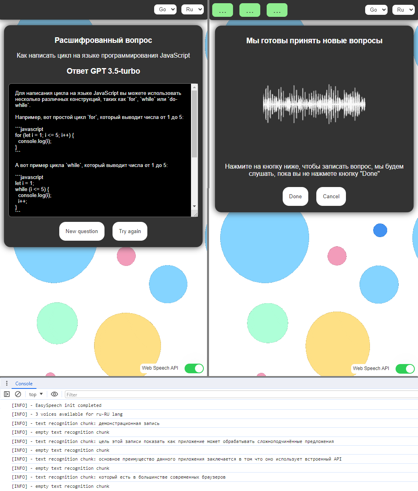

# how-to

* Enter the OPEN AI `api key` in the prompt (https://platform.openai.com/api-keys)
* Press the "Click me" button in the user interface or just press the "space bar" on the keyboard and hold it down to record the sound

Copilot will listen to your question, convert it into text and send it to the OPEN AI API, after which the answer will be shown in the copilot user interface

# screenshots

